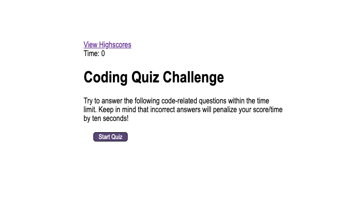

# HW4 Coding Quiz

# Link:
https://github.com/angelfloreschicago/hw4_CodingQuiz

## User Story
AS A coding boot camp student
I WANT to take a timed quiz on JavaScript fundamentals that stores high scores
SO THAT I can gauge my progress compared to my peers

## Page Guide/Description
-The Page begins with some information about the quiz rules.
-When the start quiz button is clicked the user is presented with first question.
-The cycle continues to the following question until the user reaches the last question.
-After the user is asked to input their initials to record there score to the website.
-After the user is presented with a different site that hold their score and past users scores. 

## Notes
This project is still a work in progress. There will be some missing features that I hope I get to fix once
I do some more research. I still need to fix a few bugs like the prompts, timer, and scores. I will try my best 
to come back and fix them in the future. Any tips are highly appreciated! 